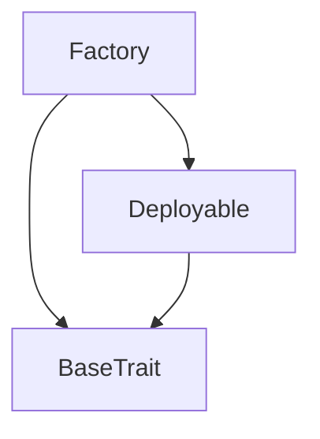
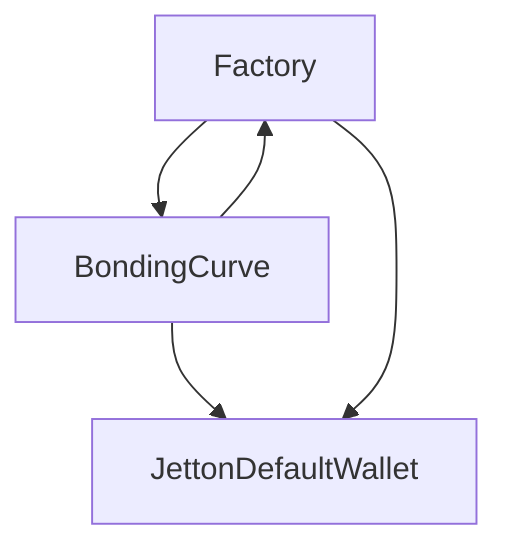

# TACT Compilation Report
Contract: Factory
BOC Size: 2316 bytes

# Types
Total Types: 37

## StateInit
TLB: `_ code:^cell data:^cell = StateInit`
Signature: `StateInit{code:^cell,data:^cell}`

## Context
TLB: `_ bounced:bool sender:address value:int257 raw:^slice = Context`
Signature: `Context{bounced:bool,sender:address,value:int257,raw:^slice}`

## SendParameters
TLB: `_ bounce:bool to:address value:int257 mode:int257 body:Maybe ^cell code:Maybe ^cell data:Maybe ^cell = SendParameters`
Signature: `SendParameters{bounce:bool,to:address,value:int257,mode:int257,body:Maybe ^cell,code:Maybe ^cell,data:Maybe ^cell}`

## Deploy
TLB: `deploy#946a98b6 queryId:uint64 = Deploy`
Signature: `Deploy{queryId:uint64}`

## DeployOk
TLB: `deploy_ok#aff90f57 queryId:uint64 = DeployOk`
Signature: `DeployOk{queryId:uint64}`

## FactoryDeploy
TLB: `factory_deploy#6d0ff13b queryId:uint64 cashback:address = FactoryDeploy`
Signature: `FactoryDeploy{queryId:uint64,cashback:address}`

## JettonData
TLB: `_ total_supply:int257 mintable:bool owner:address content:^cell wallet_code:^cell = JettonData`
Signature: `JettonData{total_supply:int257,mintable:bool,owner:address,content:^cell,wallet_code:^cell}`

## JettonWalletData
TLB: `_ balance:int257 owner:address master:address code:^cell = JettonWalletData`
Signature: `JettonWalletData{balance:int257,owner:address,master:address,code:^cell}`

## TokenTransfer
TLB: `token_transfer#0f8a7ea5 query_id:uint64 amount:coins destination:address response_destination:Maybe address custom_payload:Maybe ^cell forward_ton_amount:coins forward_payload:remainder<slice> = TokenTransfer`
Signature: `TokenTransfer{query_id:uint64,amount:coins,destination:address,response_destination:Maybe address,custom_payload:Maybe ^cell,forward_ton_amount:coins,forward_payload:remainder<slice>}`

## TokenTransferInternal
TLB: `token_transfer_internal#178d4519 query_id:uint64 amount:coins from:address response_destination:Maybe address forward_ton_amount:coins forward_payload:remainder<slice> = TokenTransferInternal`
Signature: `TokenTransferInternal{query_id:uint64,amount:coins,from:address,response_destination:Maybe address,forward_ton_amount:coins,forward_payload:remainder<slice>}`

## TokenNotification
TLB: `token_notification#7362d09c query_id:uint64 amount:coins from:address forward_payload:remainder<slice> = TokenNotification`
Signature: `TokenNotification{query_id:uint64,amount:coins,from:address,forward_payload:remainder<slice>}`

## TokenBurn
TLB: `token_burn#595f07bc query_id:uint64 amount:coins response_destination:Maybe address custom_payload:Maybe ^cell = TokenBurn`
Signature: `TokenBurn{query_id:uint64,amount:coins,response_destination:Maybe address,custom_payload:Maybe ^cell}`

## TokenBurnNotification
TLB: `token_burn_notification#7bdd97de query_id:uint64 amount:coins sender:address response_destination:Maybe address = TokenBurnNotification`
Signature: `TokenBurnNotification{query_id:uint64,amount:coins,sender:address,response_destination:Maybe address}`

## TokenExcesses
TLB: `token_excesses#d53276db query_id:uint64 = TokenExcesses`
Signature: `TokenExcesses{query_id:uint64}`

## TokenUpdateContent
TLB: `token_update_content#af1ca26a content:^cell = TokenUpdateContent`
Signature: `TokenUpdateContent{content:^cell}`

## Mint
TLB: `mint#89a35a1f  = Mint`
Signature: `Mint{}`

## ProvideWalletAddress
TLB: `provide_wallet_address#2c76b973 query_id:uint64 owner_address:address include_address:bool = ProvideWalletAddress`
Signature: `ProvideWalletAddress{query_id:uint64,owner_address:address,include_address:bool}`

## TakeWalletAddress
TLB: `take_wallet_address#d1735400 query_id:uint64 wallet_address:address owner_address:remainder<slice> = TakeWalletAddress`
Signature: `TakeWalletAddress{query_id:uint64,wallet_address:address,owner_address:remainder<slice>}`

## InitReferral
TLB: `init_referral#b0d0d2da referrer:address = InitReferral`
Signature: `InitReferral{referrer:address}`

## Buy
TLB: `buy#acf8a4e6 tonAmount:int257 minOut:int257 referrer:address referrerDl1:address referrerDl2:address treasury:address trader:address = Buy`
Signature: `Buy{tonAmount:int257,minOut:int257,referrer:address,referrerDl1:address,referrerDl2:address,treasury:address,trader:address}`

## BuyCall
TLB: `buy_call#acd2a5b1 tonAmount:int257 minOut:int257 referrer:address jetton:address = BuyCall`
Signature: `BuyCall{tonAmount:int257,minOut:int257,referrer:address,jetton:address}`

## SellCall
TLB: `sell_call#e5363368 referrer:address jetton:address jettonAmount:int257 minTonOut:int257 = SellCall`
Signature: `SellCall{referrer:address,jetton:address,jettonAmount:int257,minTonOut:int257}`

## Sell
TLB: `sell#3b6b4526 referrerDl1:address referrerDl2:address treasury:address trader:address jettonAmount:int257 minTonOut:int257 referrer:address = Sell`
Signature: `Sell{referrerDl1:address,referrerDl2:address,treasury:address,trader:address,jettonAmount:int257,minTonOut:int257,referrer:address}`

## RefReward
TLB: `ref_reward#9bb0c755 totalFee:int257 level:uint8 = RefReward`
Signature: `RefReward{totalFee:int257,level:uint8}`

## ClaimToken
TLB: `claim_token#cd88c7c0 owner:address = ClaimToken`
Signature: `ClaimToken{owner:address}`

## BounceRefReward
TLB: `bounce_ref_reward#5e436065  = BounceRefReward`
Signature: `BounceRefReward{}`

## CreateEvent
TLB: `create_event#cc0fe28d content:^cell jetton:address creator:address = CreateEvent`
Signature: `CreateEvent{content:^cell,jetton:address,creator:address}`

## CompleteEvent
TLB: `complete_event#3d7dc901 jetton:address = CompleteEvent`
Signature: `CompleteEvent{jetton:address}`

## TradeEvent
TLB: `trade_event#71726d89 tonAmount:int257 jettonAmount:int257 jetton:address virtualTonReserve:int257 virtualTokenReserve:int257 trader:address isBuy:bool balance:int257 = TradeEvent`
Signature: `TradeEvent{tonAmount:int257,jettonAmount:int257,jetton:address,virtualTonReserve:int257,virtualTokenReserve:int257,trader:address,isBuy:bool,balance:int257}`

## ClaimEvent
TLB: `claim_event#8e8a0c23 jetton:address user:address balance:int257 = ClaimEvent`
Signature: `ClaimEvent{jetton:address,user:address,balance:int257}`

## ChangeOwner
TLB: `change_owner#819dbe99 queryId:uint64 newOwner:address = ChangeOwner`
Signature: `ChangeOwner{queryId:uint64,newOwner:address}`

## ChangeOwnerOk
TLB: `change_owner_ok#327b2b4a queryId:uint64 newOwner:address = ChangeOwnerOk`
Signature: `ChangeOwnerOk{queryId:uint64,newOwner:address}`

## BondingCurveData
TLB: `_ virtualTonReserve:int257 virtualTokenReserve:int257 complete:bool liquidityAdded:bool jettonCreator:address tokenDebt:int257 myJettonWalletAddress:address = BondingCurveData`
Signature: `BondingCurveData{virtualTonReserve:int257,virtualTokenReserve:int257,complete:bool,liquidityAdded:bool,jettonCreator:address,tokenDebt:int257,myJettonWalletAddress:address}`

## ReferralData
TLB: `_ owner:address referrer:address isInitializedByFactory:bool factory:address = ReferralData`
Signature: `ReferralData{owner:address,referrer:address,isInitializedByFactory:bool,factory:address}`

## OutputTokenAmountReturn
TLB: `_ amountOut:int257 tax:int257 remainNativeAmount:int257 = OutputTokenAmountReturn`
Signature: `OutputTokenAmountReturn{amountOut:int257,tax:int257,remainNativeAmount:int257}`

## OutputTonAmountReturn
TLB: `_ amountOut:int257 tax:int257 = OutputTonAmountReturn`
Signature: `OutputTonAmountReturn{amountOut:int257,tax:int257}`

## DeployCurveParams
TLB: `deploy_curve_params#00531283 content:^cell = DeployCurveParams`
Signature: `DeployCurveParams{content:^cell}`

# Get Methods
Total Get Methods: 3

## balance

## getBondingCurveInit
Argument: creator
Argument: content

## getReferrer
Argument: user
Argument: referrer

# Error Codes
2: Stack underflow
3: Stack overflow
4: Integer overflow
5: Integer out of expected range
6: Invalid opcode
7: Type check error
8: Cell overflow
9: Cell underflow
10: Dictionary error
13: Out of gas error
32: Method ID not found
34: Action is invalid or not supported
37: Not enough TON
38: Not enough extra-currencies
128: Null reference exception
129: Invalid serialization prefix
130: Invalid incoming message
131: Constraints error
132: Access denied
133: Contract stopped
134: Invalid argument
135: Code of a contract was not found
136: Invalid address
137: Masterchain support is not enabled for this contract
1039: cannot self refer
2944: not factory
4429: Invalid sender
5306: invalid value for claim
8685: complete
16059: Invalid value
16266: insufficient jetton balance
17598: !complete
18668: Can't Mint Anymore
23951: Insufficient gas
33172: ValueMustBeGreaterThanZero
34036: no token to claim
34744: ExceedsSlipage
35772: !liquidityAdded
41223: only factory can create
42708: Invalid sender!
43422: Invalid value - Burn
58268: value too low
62972: Invalid balance

# Trait Inheritance Diagram

# Contract Dependency Diagram

